# NTT-power-house

Processo de SDLC (Software Development Life Cycle) orientado por agentes de IA, com rastreabilidade em GitHub, gates bloqueantes e aprovação humana obrigatória. Este repositório documenta como uma demanda evolui da descoberta do problema até a entrega controlada em produção.

> **Regra principal:** a IA prepara artefatos e evidências; uma pessoa responsável aprova ou reprova cada gate. Nenhum agente pode aprovar a própria saída, pular etapa ou avançar sem o gate anterior aprovado.

## 1. Navegação rápida

- [Fonte única de verdade](./docs/sdlc/SOURCE_OF_TRUTH.md)
- [Algoritmo do Maestro](./MAESTRO.md)
- [Log de decisões](./docs/sdlc/DECISIONS.md)
- [Agente GitHub](./docs/sdlc/agentes/AGENTE_GITHUB.md)
- [Templates de decisão, gate, PR e commit](./docs/sdlc/templates/)
- [Fase 1 — Negócio](./docs/sdlc/fases/01-negocio/README.md)
- [Fase 2 — Desenvolvimento](./docs/sdlc/fases/02-desenvolvimento/README.md)
- [Fase 3 — Testes e entrega](./docs/sdlc/fases/03-testes/README.md)

A documentação em `docs/sdlc/` define o processo. As skills executáveis em `.axet-code/skills/` são a interface usada no aXet.code e devem seguir os respectivos `AGENT.md` e `GATE.md`.

## 2. Visão geral do fluxo

```mermaid
flowchart TD
  I[Demanda inicial] --> NB01[NB-01 Ideação & Discovery]
  NB01 --> G1{Gate humano}
  G1 -->|Aprovado| NB02[NB-02 Requisitos]
  NB02 --> G2{Gate humano}
  G2 -->|Aprovado| NB03[NB-03 Viabilidade & Priorização]
  NB03 --> G3{Gate humano}
  G3 -->|Go| NB04[NB-04 UI/UX Design]
  NB04 --> G4{Gate humano}
  G4 -->|Aprovado| DEV01[DEV-01 Arquitetura]
  DEV01 --> G5{Gate humano}
  G5 -->|Aprovado| DEV02[DEV-02 Plano de testes BDD]
  DEV02 --> G6{Gate humano}
  G6 -->|Aprovado| DEV03[DEV-03 Implementação/TDD]
  DEV03 --> G7{Gate humano}
  G7 -->|Aprovado| DEV04[DEV-04 Code Review]
  DEV04 --> G8{Gate humano}
  G8 -->|Aprovado| QA01[QA-01 Testes automatizados]
  QA01 --> G9{Gate humano}
  G9 -->|Aprovado| QA02[QA-02 Homologação funcional]
  QA02 --> G10{Gate humano}
  G10 -->|Aprovado| QA03[QA-03 CI/CD e staging]
  QA03 --> G11{Gate humano}
  G11 -->|Aprovado| QA04[QA-04 UAT / avaliação de negócio]
  QA04 --> G12{Gate humano}
  G12 -->|Aprovado| QA05[QA-05 Deploy em produção]
  QA05 --> G13{Gate humano}
  G13 -->|Aprovado| P[Produção / execução concluída]

  G1 -. Reprovado .-> NB01
  G2 -. Reprovado .-> NB02
  G3 -. No-Go .-> E[Execução encerrada]
  G3 -. Ajustes .-> NB03
  G4 -. Reprovado .-> NB04
  G5 -. Reprovado .-> DEV01
  G6 -. Reprovado .-> DEV02
  G7 -. Reprovado .-> DEV03
  G8 -. Reprovado .-> DEV04
  G9 -. Reprovado .-> QA01
  G10 -. Reprovado .-> QA02
  G11 -. Reprovado .-> etapa[Etapa causadora]
  G12 -. Reprovado .-> etapa
  G13 -. Reprovado / rollback .-> etapa
```



Cada etapa gera artefatos, preenche somente o checklist técnico do seu `GATE.md` e para para revisão humana. Em caso de reprovação, o Maestro reativa a etapa adequada com os apontamentos registrados.

## 3. Papéis e responsabilidades

### Maestro — orquestração

Skill: `%maestro`.

É o único componente com visão ponta a ponta. Ele:

1. cria ou lê `docs/sdlc/execucoes/<slug>/STATUS.md`;
2. identifica a próxima etapa pendente;
3. valida o gate anterior;
4. aciona a skill da etapa com os artefatos anteriores como contexto;
5. encaminha os artefatos ao Agente GitHub;
6. interrompe o fluxo para aprovação humana;
7. retoma a próxima etapa após aprovação ou reabre a etapa após reprovação;
8. marca a execução como concluída depois do gate final aprovado.

O Maestro **não** preenche aprovação humana, não gera os artefatos de uma etapa, não executa `git`/`gh` e não altera a ordem do fluxo.

### Agentes de etapa

Cada agente é responsável por uma única etapa. Deve ler o `AGENT.md` e o `GATE.md` correspondentes, respeitar seu escopo, gerar as saídas previstas e devolver ao Maestro:

- artefatos produzidos;
- evidências e resultados técnicos;
- checklist técnico do gate preenchido;
- pendências que ainda dependem de decisão humana.

As skills disponíveis estão em `.axet-code/skills/`. Entre as skills de etapa estão `%sdlc-nb01-ideacao`, `%sdlc-nb02-requisitos`, `%sdlc-nb03-viabilidade`, `%sdlc-dev01-arquitetura`, `%sdlc-dev03-tdd`, `%sdlc-dev04-code-review`, `%sdlc-qa01-testes-automatizados`, `%sdlc-qa02-testes-manuais`, `%sdlc-qa04-avaliacao-negocio` e `%sdlc-qa05-deploy`.

### Agente GitHub — controle de versão

Skill: `%github-agent-sdlc`.

É o único agente autorizado a materializar o processo no GitHub: branches, commits, push, PRs, labels, merge e registros de aprovação. Ele não decide o conteúdo técnico da etapa nem inventa aprovadores.

## 4. Etapas detalhadas

### Fase 1 — Negócio

Objetivo: transformar uma ideia em uma oportunidade compreendida, especificada, viável e pronta para desenho técnico.

| Código | Responsabilidade do agente | Principais saídas | Aprovador típico |
|---|---|---|---|
| **NB-01** Ideação & Discovery | Estruturar problema, contexto, stakeholders, objetivos, hipóteses, riscos e métricas de sucesso. | `NB-01-discovery.md` | Product Owner / Sponsor |
| **NB-02** Requisitos | Converter o discovery em requisitos funcionais e não funcionais, histórias e critérios de aceite testáveis. | `NB-02-especificacao-requisitos.md` | Product Owner / Business Analyst líder |
| **NB-03** Viabilidade & Priorização | Avaliar esforço, custo-benefício, riscos, dependências, prioridade e recomendação explícita de Go/No-Go. | `NB-03-viabilidade.md` / business case | Sponsor / Comitê de priorização |
| **NB-04** UI/UX Design | Transformar requisitos em jornadas, fluxos, wireframes/mockups, decisões de usabilidade e acessibilidade. | `NB-04-ui-ux.md` | Product Owner / Designer UX-UI |

O Go de NB-03 libera NB-04. O gate aprovado de NB-04 libera DEV-01. Um No-Go encerra a execução sem iniciar o desenvolvimento.

### Fase 2 — Desenvolvimento

Objetivo: transformar o pacote aprovado em solução implementada e revisada.

| Código | Responsabilidade do agente | Principais saídas | Aprovador típico |
|---|---|---|---|
| **DEV-01** Arquitetura & Design Técnico | Definir componentes, integrações, dados, contratos, requisitos não funcionais, segurança, observabilidade e decisões arquiteturais. | `DEV-01-arquitetura.md` e ADRs | Arquiteto / Tech Lead |
| **DEV-02** Plano de Testes BDD | Converter critérios de aceite em cenários Gherkin, cobrindo caminhos felizes, alternativos, bordas e erros, com matriz de rastreabilidade. | `.feature` / `DEV-02-plano-testes.feature.md` | QA Lead / Tech Lead |
| **DEV-03** Implementação / TDD | Implementar a solução conforme arquitetura, requisitos e cenários aprovados, incluindo testes unitários e documentação necessária. | Código, testes e `DEV-03-implementacao.md` | Tech Lead / Desenvolvedor sênior |
| **DEV-04** Code Review & Qualidade | Revisar arquitetura, requisitos, segurança, legibilidade, complexidade, análise estática e testes, sem pendências bloqueantes. | `DEV-04-code-review.md` e comentários no PR | Revisor humano / CODEOWNERS |

O gate aprovado de DEV-04 libera QA-01.

### Fase 3 — Testes e entrega

Objetivo: validar qualidade técnica, comportamento funcional, aceite do negócio e entrega controlada.

| Código | Responsabilidade do agente | Principais saídas | Aprovador típico |
|---|---|---|---|
| **QA-01** Testes Automatizados | Criar ou completar testes unitários e de integração, verificar cobertura, execução da suíte e rastreabilidade aos requisitos. | Testes e `QA-01-testes-automatizados.md` | QA Lead / Tech Lead |
| **QA-02** Homologação Funcional | Executar testes manuais, exploratórios e end-to-end em homologação, mantendo evidências e defeitos classificados. | `QA-02-homologacao.md` | Analista de QA |
| **QA-03** CI/CD e Staging | Validar pipeline, build, empacotamento, execução dos testes, artefato versionado e deploy em staging/homologação. | `QA-03-cicd.md`, pipeline e artefato | Tech Lead / DevOps |
| **QA-04** UAT / Avaliação de Negócio | Realizar aceite com usuários, validar os critérios de sucesso do discovery e classificar feedback e pendências. | `QA-04-uat.md` | Product Owner / Usuário-chave |
| **QA-05** Deploy / Release | Executar entrega controlada, pré-checks, migrações, plano de rollback, smoke test e registro pós-deploy. | `QA-05-deploy.md`, tag e evidências | Tech Lead / Operações |

A aprovação de QA-05 marca a execução como `Concluída`. QA-03 não autoriza produção; ele valida o caminho técnico até staging. O deploy produtivo só ocorre em QA-05, após UAT aprovado.

## 5. Como uma demanda é executada

### Início

O usuário fornece uma demanda, contexto e, quando possível, o slug do projeto. O Maestro cria:

```text
docs/sdlc/execucoes/<slug-da-demanda>/
└── STATUS.md
```

O `STATUS.md` funciona como painel da execução e registra etapa, status, PR, aprovador e data. Todas as etapas começam como `Pendente`.

### Execução de uma etapa

1. O Maestro identifica a etapa corrente e verifica o gate anterior.
2. A skill da etapa lê seus documentos normativos e os artefatos já aprovados.
3. O agente produz o artefato e preenche somente o checklist técnico.
4. O Maestro aciona `%github-agent-sdlc`.
5. O Agente GitHub cria ou atualiza a branch, faz o commit de trabalho, abre o PR e marca `status:em-aprovacao`.
6. O Maestro para e informa ao responsável humano onde revisar o `GATE.md`.

### Aprovação

O humano preenche a tabela **Registro de Aprovação Humana** no `GATE.md`. Depois da confirmação:

- **Aprovado:** o Agente GitHub registra a decisão, atualiza labels, cria o commit final com trailers e faz merge do PR na branch de integração; o Maestro avança.
- **Aprovado com ressalvas:** segue o mesmo caminho, mantendo as ressalvas registradas e rastreáveis.
- **Reprovado:** o PR não é mergeado, os apontamentos são registrados em `DECISIONS.md` e a mesma etapa é reativada para correção.

O Maestro nunca considera aprovação apenas porque o checklist técnico está completo.

## 6. Controle no GitHub

Cada etapa possui uma branch própria no padrão:

```text
sdlc/<fase>/<codigo-etapa-lowercase>/<slug-da-demanda>
```

Exemplos:

```text
sdlc/negocio/nb-02/checkout-pix
sdlc/desenvolvimento/dev-03/checkout-pix
sdlc/testes/qa-05/checkout-pix
```

Cada etapa entrega um PR para a branch de integração da demanda. O PR deve usar `docs/sdlc/templates/TEMPLATE_PR.md` e as labels:

- `fase:negocio`, `fase:desenvolvimento` ou `fase:testes`;
- `etapa:<código>`;
- `status:em-aprovacao`, depois `status:aprovado` ou `status:reprovado`.

Commits aprovados seguem `TEMPLATE_COMMIT.md` e incluem `Gate`, `Gate-Status`, `Approved-by`, `Approved-at`, `Decision-ref` e `Agent`. Os dados de aprovação vêm exclusivamente do registro preenchido pelo humano.

Regras essenciais:

- nunca fazer merge direto em `main`/`master` fora de PR;
- nunca fazer force-push em branch compartilhada sem confirmação explícita;
- nunca apagar branches ou tags sem confirmação explícita;
- nunca alterar histórico já mergeado;
- confirmar antes de fazer push para um remoto real em ambiente de teste/sandbox.

## 7. Rastreabilidade e artefatos

### `SOURCE_OF_TRUTH.md`

Define princípios, ordem, agentes, governança de skills, convenções de GitHub e estrutura do processo. Em caso de dúvida, deve ser consultado primeiro.

### `AGENT.md` e `GATE.md`

Cada etapa possui instruções detalhadas e critérios de saída. O `AGENT.md` define o trabalho do agente; o `GATE.md` separa checklist técnico da decisão humana.

### `STATUS.md`

É o painel por demanda. Deve permanecer atualizado durante toda a execução e indicar claramente se a execução está `Em andamento`, `Concluída` ou `Bloqueada`.

### `DECISIONS.md`

É um log append-only. Decisões de negócio, escopo, arquitetura, risco e aprovação/reprovação devem ser registradas com ID sequencial, data, responsável, aprovador, justificativa e referências. Uma decisão revisada gera nova entrada com `Supersede`, sem editar a anterior.

## 8. Governança e segurança do fluxo

- Aprovação humana é obrigatória em todos os gates.
- Gates são bloqueantes: sem aprovação anterior, não há próxima etapa.
- Agentes ficam limitados ao próprio escopo.
- Alterar o comportamento de um agente exige atualizar primeiro o `AGENT.md`/`GATE.md`; a skill é uma interface fina.
- Segredos e credenciais não podem ser incluídos em commits.
- Segurança, performance, escalabilidade e observabilidade devem ser consideradas na arquitetura e verificadas no review.
- Deploy deve possuir pré-checks, rollback e smoke test.
- Falhas, exceções, ressalvas e incidentes devem ser evidenciados e registrados.

## 9. Convenções de uso no aXet.code

As skills são invocadas com `%nome-da-skill`. Exemplos:

```text
%maestro iniciar a demanda checkout-pix
%maestro continuar a execução checkout-pix
%github-agent-sdlc registrar a aprovação do gate DEV-04
```

O uso recomendado é acionar o Maestro, e não chamar agentes de etapa isoladamente, porque somente o Maestro valida a ordem e as pré-condições. O Agente GitHub só deve ser acionado para materializar mudanças no repositório e registrar o estado no GitHub.

## 10. Nota de alinhamento da documentação

Este README descreve o fluxo operacional consolidado a partir dos agentes e gates existentes: NB-01 a NB-04, DEV-01 a DEV-04 e QA-01 a QA-05. Alguns READMEs legados das fases ainda apresentam uma numeração reduzida ou nomes anteriores. Para executar o processo, prevalecem a sequência e os documentos das etapas em `docs/sdlc/fases/`, o `SOURCE_OF_TRUTH.md`, o `MAESTRO.md` e os registros da execução; a divergência deve ser corrigida nesses documentos normativos em uma evolução posterior.
