# SOURCE OF TRUTH — Processo de SDLC

> Este arquivo é a **fonte única de verdade** do processo de desenvolvimento de software desta organização. Qualquer agente (humano ou IA) que precise saber "o que fazer agora", "quem faz o quê" ou "onde estão os artefatos" deve consultar este documento antes de qualquer outro.

Última atualização: mantenha esta linha atualizada a cada alteração estrutural do processo.

## 1. Princípios inegociáveis

1. **Aprovação humana obrigatória.** Nenhuma saída gerada por IA avança de etapa sem aprovação explícita de uma pessoa responsável, registrada no `GATE.md` da etapa. IA nunca aprova a própria saída nem a de outro agente de IA.
2. **Gates bloqueantes.** Uma etapa só pode iniciar se o gate da etapa anterior estiver `Aprovado` (ou `Aprovado com ressalvas`). Não existe "pular etapa".
3. **Rastreabilidade total.** Toda decisão relevante (técnica, de negócio, de escopo, de risco, de aprovação/reprovação de gate) é registrada em [`DECISIONS.md`](./DECISIONS.md) com autor, data e justificativa.
4. **GitHub é o sistema de controle.** O estado real de cada etapa (aprovada, pendente, reprovada) vive no repositório GitHub — em branches, Pull Requests, labels e commits —, não apenas em texto solto. O [`AGENTE_GITHUB`](./agentes/AGENTE_GITHUB.md) é o único agente autorizado a executar comandos `git`/`gh`.
5. **Um agente por etapa.** Cada etapa do fluxo tem um agente de IA dedicado (via skill), com entradas, saídas e critérios de saída (gate) claramente definidos. Nenhum agente de etapa executa fora do seu escopo.
6. **Orquestração centralizada.** O [`MAESTRO`](./agentes/MAESTRO.md) é o único agente autorizado a decidir qual agente/skill de etapa acionar em seguida, com base no status dos gates.

## 2. Estrutura de diretórios (mapa de arquivos)

```
docs/sdlc/
├── SOURCE_OF_TRUTH.md          <- este arquivo
├── DECISIONS.md                <- log de decisões (append-only)
├── agentes/
│   ├── MAESTRO.md               <- agente orquestrador
│   └── AGENTE_GITHUB.md         <- agente de controle de versão/GitHub
├── templates/
│   ├── TEMPLATE_DECISAO.md
│   ├── TEMPLATE_GATE_APROVACAO.md
│   ├── TEMPLATE_PR.md
│   └── TEMPLATE_COMMIT.md
├── execucoes/
│   └── <slug-do-projeto>/STATUS.md   <- criado pelo Maestro a cada demanda/projeto real
└── fases/
    ├── 01-negocio/
    │   ├── README.md
    │   ├── NB-01-ideacao-discovery/{AGENT.md, GATE.md}
    │   ├── NB-02-levantamento-requisitos/{AGENT.md, GATE.md}
    │   └── NB-03-viabilidade-priorizacao/{AGENT.md, GATE.md}
    ├── 02-desenvolvimento/
    │   ├── README.md
    │   ├── DEV-01-arquitetura-design/{AGENT.md, GATE.md}
    │   ├── DEV-02-implementacao/{AGENT.md, GATE.md}
    │   └── DEV-03-code-review-qualidade/{AGENT.md, GATE.md}
    └── 03-testes/
        ├── README.md
        ├── QA-01-testes-automatizados/{AGENT.md, GATE.md}
        ├── QA-02-homologacao/{AGENT.md, GATE.md}
        ├── QA-03-aceite-uat/{AGENT.md, GATE.md}
        └── QA-04-deploy-entrega/{AGENT.md, GATE.md}
```

As skills executáveis (invocadas com `%nome-da-skill` no aXet.code) ficam em `.axet-code/skills/` e são **espelhos finos** dos arquivos `AGENT.md`/`GATE.md` — a skill nunca contém regra que não esteja documentada aqui. Ver seção 5.

## 3. Fluxo completo (fases → etapas → gates)

```mermaid
flowchart TD
  subgraph F1["FASE 1 · NEGOCIO"]
    NB01[NB-01 Ideacao e Discovery] --> GNB01{{"Gate NB-01\n(aprovacao humana)"}}
    GNB01 -->|Aprovado| NB02[NB-02 Levantamento de Requisitos]
    NB02 --> GNB02{{"Gate NB-02\n(aprovacao humana)"}}
    GNB02 -->|Aprovado| NB03[NB-03 Viabilidade e Priorizacao]
    NB03 --> GNB03{{"Gate NB-03\n(aprovacao humana)"}}
  end

  GNB03 -->|Aprovado| DEV01

  subgraph F2["FASE 2 · DESENVOLVIMENTO"]
    DEV01[DEV-01 Arquitetura e Design] --> GDEV01{{"Gate DEV-01\n(aprovacao humana)"}}
    GDEV01 -->|Aprovado| DEV02[DEV-02 Implementacao]
    DEV02 --> GDEV02{{"Gate DEV-02\n(aprovacao humana)"}}
    GDEV02 -->|Aprovado| DEV03[DEV-03 Code Review e Qualidade]
    DEV03 --> GDEV03{{"Gate DEV-03\n(aprovacao humana)"}}
  end

  GDEV03 -->|Aprovado| QA01

  subgraph F3["FASE 3 · TESTES"]
    QA01[QA-01 Testes Automatizados] --> GQA01{{"Gate QA-01\n(aprovacao humana)"}}
    GQA01 -->|Aprovado| QA02[QA-02 Homologacao / QA Funcional]
    QA02 --> GQA02{{"Gate QA-02\n(aprovacao humana)"}}
    GQA02 -->|Aprovado| QA03[QA-03 Aceite do Usuario - UAT]
    QA03 --> GQA03{{"Gate QA-03\n(aprovacao humana)"}}
    GQA03 -->|Aprovado| QA04[QA-04 Deploy / Entrega Tecnologica]
    QA04 --> GQA04{{"Gate QA-04\n(aprovacao humana)"}}
  end

  GQA04 -->|Aprovado| PROD[("Ambiente de Producao")]

  GNB01 -.->|Reprovado| NB01
  GNB02 -.->|Reprovado| NB02
  GNB03 -.->|Reprovado| NB03
  GDEV01 -.->|Reprovado| DEV01
  GDEV02 -.->|Reprovado| DEV02
  GDEV03 -.->|Reprovado| DEV03
  GQA01 -.->|Reprovado| QA01
  GQA02 -.->|Reprovado| QA02
  GQA03 -.->|Reprovado| QA03
  GQA04 -.->|Reprovado| QA04
```



Toda reprovação de gate gera um registro em `DECISIONS.md` e o Agente GitHub reabre/comenta o Pull Request da etapa com os apontamentos, sem avançar a demanda.

## 4. Tabela de mapeamento (fonte única)

| Código | Fase | Etapa | Agente (IA) | Skill aXet.code | Docs da etapa | Aprovador humano típico |
|---|---|---|---|---|---|---|
| — | Transversal | Orquestração | Agente Maestro | `%maestro-sdlc` | `agentes/MAESTRO.md` | N/A (não aprova gates) |
| — | Transversal | Controle de versão | Agente GitHub | `%github-agent-sdlc` | `agentes/AGENTE_GITHUB.md` | N/A (executa, não aprova) |
| NB-01 | 1. Negócio | Ideação & Discovery | Agente de Ideação | `%sdlc-nb01-ideacao` | `fases/01-negocio/NB-01-ideacao-discovery/` | Product Owner / Sponsor |
| NB-02 | 1. Negócio | Levantamento de Requisitos | Agente de Requisitos | `%sdlc-nb02-requisitos` | `fases/01-negocio/NB-02-levantamento-requisitos/` | Product Owner / Business Analyst líder |
| NB-03 | 1. Negócio | Viabilidade & Priorização | Agente de Viabilidade | `%sdlc-nb03-viabilidade` | `fases/01-negocio/NB-03-viabilidade-priorizacao/` | Sponsor / Comitê de priorização |
| DEV-01 | 2. Desenvolvimento | Arquitetura & Design Técnico | Agente de Arquitetura | `%sdlc-dev01-arquitetura` | `fases/02-desenvolvimento/DEV-01-arquitetura-design/` | Arquiteto de Software / Tech Lead |
| DEV-02 | 2. Desenvolvimento | Implementação (Codificação) | Agente de Implementação | `%sdlc-dev02-implementacao` | `fases/02-desenvolvimento/DEV-02-implementacao/` | Tech Lead / Desenvolvedor sênior |
| DEV-03 | 2. Desenvolvimento | Code Review & Qualidade Estática | Agente de Code Review | `%sdlc-dev03-code-review` | `fases/02-desenvolvimento/DEV-03-code-review-qualidade/` | Revisor(es) de código (CODEOWNERS) |
| QA-01 | 3. Testes | Testes Automatizados (unit./integr.) | Agente de Testes Automatizados | `%sdlc-qa01-testes-automatizados` | `fases/03-testes/QA-01-testes-automatizados/` | QA Lead / Tech Lead |
| QA-02 | 3. Testes | Homologação / QA Funcional | Agente de QA/Homologação | `%sdlc-qa02-homologacao` | `fases/03-testes/QA-02-homologacao/` | Analista de QA |
| QA-03 | 3. Testes | Aceite do Usuário (UAT) | Agente de UAT | `%sdlc-qa03-uat` | `fases/03-testes/QA-03-aceite-uat/` | Product Owner / Usuário-chave de negócio |
| QA-04 | 3. Testes | Deploy / Entrega em Ambiente Tecnológico | Agente de Deploy/Release | `%sdlc-qa04-deploy` | `fases/03-testes/QA-04-deploy-entrega/` | Tech Lead / Responsável de Operações (change owner) |

## 5. Governança de skills

- Toda skill em `.axet-code/skills/<nome>/SKILL.md` referente a este processo **deve**:
  1. Citar no cabeçalho o caminho do `AGENT.md` e do `GATE.md` correspondentes e ler/seguir literalmente o que está lá.
  2. Nunca marcar um item de aprovação humana do `GATE.md` como concluído — apenas preencher o checklist técnico e deixar a tabela de aprovação para a pessoa responsável.
  3. Delegar qualquer `git`/`gh`/push ao `%github-agent-sdlc`, nunca executar diretamente.
  4. Registrar decisões relevantes em `DECISIONS.md` usando `templates/TEMPLATE_DECISAO.md`.
  5. Ao final, devolver o controle ao `%maestro-sdlc` informando: etapa concluída, artefatos gerados, checklist técnico do gate e o que falta para aprovação humana.
- Alterar o comportamento de um agente = editar primeiro o `AGENT.md`/`GATE.md` correspondente e só depois a skill. A skill nunca é a fonte de verdade, apenas a interface de execução.

## 6. Controle no GitHub (visão geral)

- Cada etapa de cada demanda roda em uma branch própria: `sdlc/<fase>/<codigo-etapa>/<slug-da-demanda>` (ex.: `sdlc/negocio/nb-02/checkout-pix`).
- Cada etapa é entregue via **Pull Request** para a branch de integração da demanda, usando `templates/TEMPLATE_PR.md`.
- O merge do PR só ocorre após a tabela de aprovação do `GATE.md` estar preenchida com decisão `Aprovado` (ou `Aprovado com ressalvas`).
- Commits gerados pelo Agente GitHub carregam metadados de aprovação (trailers) conforme `templates/TEMPLATE_COMMIT.md`, incluindo quem aprovou o gate e a referência da decisão em `DECISIONS.md`.
- Detalhe completo do fluxo git/PR/labels: ver [`agentes/AGENTE_GITHUB.md`](./agentes/AGENTE_GITHUB.md).

## 7. Acompanhamento por execução (projeto/demanda real)

Para cada demanda real que percorre o fluxo, o Maestro cria `docs/sdlc/execucoes/<slug-da-demanda>/STATUS.md` com o status atual de cada etapa (código, status do gate, PR, aprovador, data). Este arquivo é o "painel" daquela demanda; o processo genérico continua sendo o descrito neste `SOURCE_OF_TRUTH.md` e nas pastas `fases/`.

## 8. Referências rápidas

- Log de decisões: [`DECISIONS.md`](./DECISIONS.md)
- Agente orquestrador: [`agentes/MAESTRO.md`](./agentes/MAESTRO.md)
- Agente de GitHub: [`agentes/AGENTE_GITHUB.md`](./agentes/AGENTE_GITHUB.md)
- Fase Negócio: [`fases/01-negocio/README.md`](./fases/01-negocio/README.md)
- Fase Desenvolvimento: [`fases/02-desenvolvimento/README.md`](./fases/02-desenvolvimento/README.md)
- Fase Testes: [`fases/03-testes/README.md`](./fases/03-testes/README.md)
